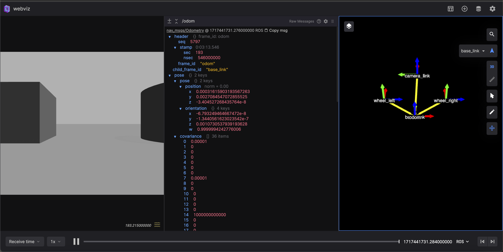
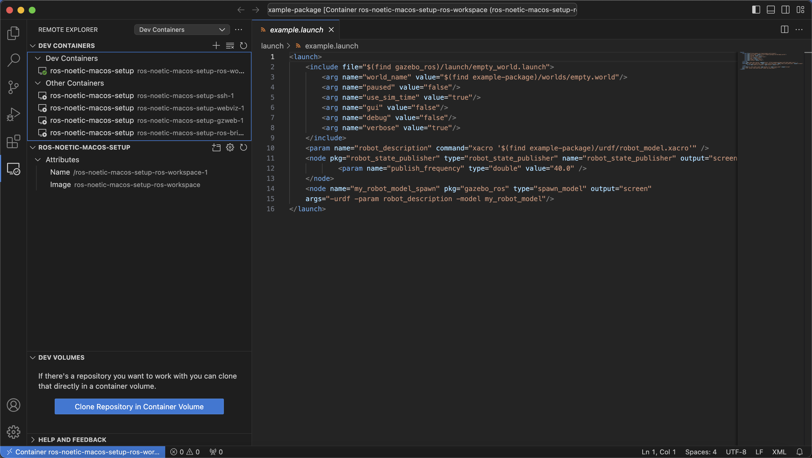

# ROS Noetic setup for macOS

```
docker compose build
docker compose up
```

**webviz** - `http://127.0.0.1:8080/` \
**GzWeb** - `http://127.0.0.1:8181/`

# GzWeb
Web interface for Gazebo

# webviz
Web interface for visualization

# ssh
You can connect to container via ssh to have access to ROS command-line tools
```
ssh ros@127.0.0.1 -p 2222
```
**password**: `admin` \
Also run this commands
```
export ROS_MASTER_URI=http://ros-master:11311
source /opt/ros/noetic/setup.bash
```
Now you can use ROS cli tools


# VS Code
You can open your workspace folder using vscode dev containers plugin
